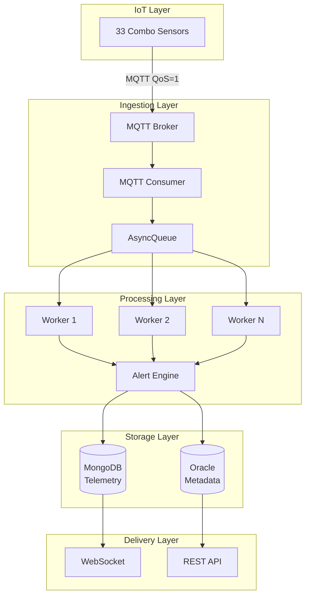
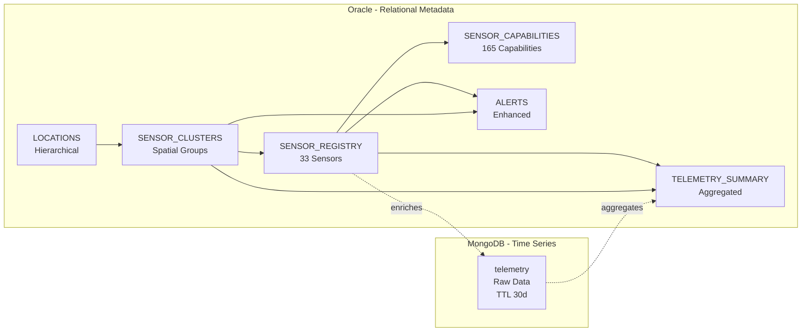
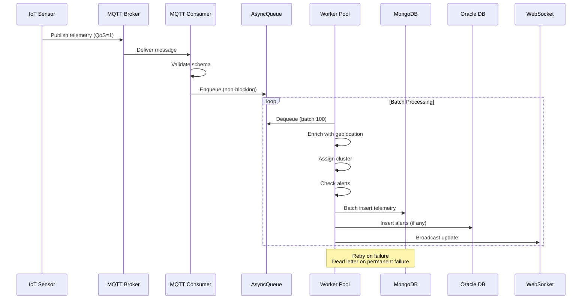
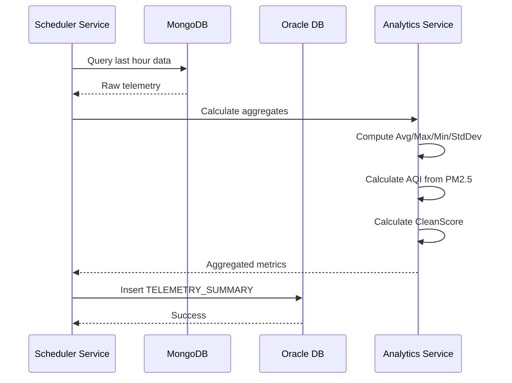

# Design Document: Database Redesign for Smart City IoT Dashboard

## Overview

This design document outlines the production-ready database redesign for the Smart City IoT Dashboard project. The redesign addresses critical limitations in the current schema and introduces advanced features including spatial clustering, geolocation-based queries, predictive alerts, anomaly detection, and enhanced data analytics. The system will support 33 sensors across 9 wards in Ho Chi Minh City, with each sensor capable of measuring 5 environmental metrics (CO2, Noise, Temperature, PM2.5, Humidity).

## Architecture

### System Architecture



### Database Architecture



## Main Algorithm/Workflow

### Data Ingestion Flow



### Hourly Aggregation Flow



## Core Interfaces/Types

### Oracle Schema - Core Tables

#### LOCATIONS Table
```sql
CREATE TABLE LOCATIONS (
    LocationID  VARCHAR2(50)  PRIMARY KEY,
    Name        VARCHAR2(100) NOT NULL,
    ParentID    VARCHAR2(50),  -- Self-referencing FK
    Type        VARCHAR2(20)  NOT NULL CHECK (Type IN ('City','District','Ward')),
    CenterLat   NUMBER(10,8),
    CenterLng   NUMBER(11,8),
    Geometry    CLOB,          -- GeoJSON polygon
    Area        NUMBER(12,2),  -- km²
    Population  NUMBER,
    CreatedAt   TIMESTAMP DEFAULT CURRENT_TIMESTAMP,
    UpdatedAt   TIMESTAMP DEFAULT CURRENT_TIMESTAMP,
    CONSTRAINT fk_locations_parent FOREIGN KEY (ParentID) REFERENCES LOCATIONS(LocationID)
);
```

#### SENSOR_CLUSTERS Table
```sql
CREATE TABLE SENSOR_CLUSTERS (
    ClusterID    VARCHAR2(50)  PRIMARY KEY,
    LocationID   VARCHAR2(50)  NOT NULL,
    ClusterName  VARCHAR2(100),
    CenterLat    NUMBER(10,8)  NOT NULL,
    CenterLng    NUMBER(11,8)  NOT NULL,
    Radius       NUMBER(8,2)   NOT NULL,  -- meters
    SensorCount  NUMBER        DEFAULT 0,
    Algorithm    VARCHAR2(50),  -- KMEANS/DBSCAN/GRID
    CreatedAt    TIMESTAMP DEFAULT CURRENT_TIMESTAMP,
    UpdatedAt    TIMESTAMP DEFAULT CURRENT_TIMESTAMP,
    CONSTRAINT fk_clusters_location FOREIGN KEY (LocationID) REFERENCES LOCATIONS(LocationID)
);
```

#### SENSOR_REGISTRY Table
```sql
CREATE TABLE SENSOR_REGISTRY (
    SensorID         VARCHAR2(50)  PRIMARY KEY,
    LocationID       VARCHAR2(50)  NOT NULL,
    ClusterID        VARCHAR2(50),
    Latitude         NUMBER(10,8)  NOT NULL,
    Longitude        NUMBER(11,8)  NOT NULL,
    Altitude         NUMBER(7,2),
    SensorModel      VARCHAR2(100),
    FirmwareVersion  VARCHAR2(50),
    Status           VARCHAR2(20)  DEFAULT 'Active' NOT NULL
                         CHECK (Status IN ('Active','Offline','Maintenance','Decommissioned')),
    InstallDate      DATE          NOT NULL,
    LastMaintenance  DATE,
    NextMaintenance  DATE,
    RegisteredAt     TIMESTAMP DEFAULT CURRENT_TIMESTAMP,
    UpdatedAt        TIMESTAMP DEFAULT CURRENT_TIMESTAMP,
    CONSTRAINT fk_sensors_location FOREIGN KEY (LocationID) REFERENCES LOCATIONS(LocationID),
    CONSTRAINT fk_sensors_cluster FOREIGN KEY (ClusterID) REFERENCES SENSOR_CLUSTERS(ClusterID)
);
```

#### SENSOR_CAPABILITIES Table (Normalized)
```sql
CREATE TABLE SENSOR_CAPABILITIES (
    CapabilityID      VARCHAR2(50)  PRIMARY KEY,
    SensorID          VARCHAR2(50)  NOT NULL,
    MetricType        VARCHAR2(20)  NOT NULL,  -- CO2/Noise/Temperature/PM2.5/Humidity
    Unit              VARCHAR2(20)  NOT NULL,  -- ppm/dB/°C/μg/m³/%
    MinRange          NUMBER(10,2),
    MaxRange          NUMBER(10,2),
    Accuracy          NUMBER(5,2),
    CalibrationDate   DATE,
    NextCalibration   DATE,
    IsActive          NUMBER(1)     DEFAULT 1 CHECK (IsActive IN (0,1)),
    CONSTRAINT fk_capabilities_sensor FOREIGN KEY (SensorID) REFERENCES SENSOR_REGISTRY(SensorID),
    CONSTRAINT uk_cap_sensor_metric UNIQUE (SensorID, MetricType)
);
```

#### ALERTS Table (Enhanced)
```sql
CREATE TABLE ALERTS (
    AlertID          VARCHAR2(50)   PRIMARY KEY,
    SensorID         VARCHAR2(50),
    ClusterID        VARCHAR2(50),
    LocationID       VARCHAR2(50)   NOT NULL,
    AlertType        VARCHAR2(30)   NOT NULL,  -- THRESHOLD/PREDICTIVE/ANOMALY/OFFLINE/CLUSTER
    MetricType       VARCHAR2(20)   NOT NULL,
    Value            NUMBER(10,2)   NOT NULL,
    Threshold        NUMBER(10,2),
    PredictedValue   NUMBER(10,2),
    ConfidenceScore  NUMBER(5,4),   -- ML confidence (0-1)
    Severity         VARCHAR2(10),
    Status           VARCHAR2(20)   DEFAULT 'OPEN',
    CreatedAt        TIMESTAMP DEFAULT CURRENT_TIMESTAMP,
    AcknowledgedAt   TIMESTAMP,
    ResolvedAt       TIMESTAMP,
    Message          CLOB,
    CONSTRAINT fk_alert_sensor FOREIGN KEY (SensorID) REFERENCES SENSOR_REGISTRY(SensorID),
    CONSTRAINT fk_alert_cluster FOREIGN KEY (ClusterID) REFERENCES SENSOR_CLUSTERS(ClusterID),
    CONSTRAINT fk_alert_location FOREIGN KEY (LocationID) REFERENCES LOCATIONS(LocationID),
    CONSTRAINT chk_alert_target CHECK (SensorID IS NOT NULL OR ClusterID IS NOT NULL)
);
```

#### TELEMETRY_SUMMARY Table
```sql
CREATE TABLE TELEMETRY_SUMMARY (
    SummaryID          VARCHAR2(50)  PRIMARY KEY,
    SensorID           VARCHAR2(50),
    ClusterID          VARCHAR2(50),
    LocationID         VARCHAR2(50),
    TimeBucket         TIMESTAMP     NOT NULL,
    Granularity        VARCHAR2(10)  NOT NULL,  -- MINUTE/HOUR/DAY/WEEK/MONTH
    AvgCO2             NUMBER(10,2),
    MaxCO2             NUMBER(10,2),
    MinCO2             NUMBER(10,2),
    StdDevCO2          NUMBER(10,2),
    AvgNoise           NUMBER(10,2),
    MaxNoise           NUMBER(10,2),
    MinNoise           NUMBER(10,2),
    StdDevNoise        NUMBER(10,2),
    AvgTemperature     NUMBER(10,2),
    MaxTemperature     NUMBER(10,2),
    MinTemperature     NUMBER(10,2),
    StdDevTemperature  NUMBER(10,2),
    AvgPM25            NUMBER(10,2),
    MaxPM25            NUMBER(10,2),
    AvgHumidity        NUMBER(5,2),
    CleanScore         NUMBER(5,2),
    AQI                NUMBER,
    DataPoints         NUMBER        NOT NULL,
    DataCompleteness   NUMBER(5,2),
    CreatedAt          TIMESTAMP DEFAULT CURRENT_TIMESTAMP,
    CONSTRAINT fk_summary_sensor FOREIGN KEY (SensorID) REFERENCES SENSOR_REGISTRY(SensorID),
    CONSTRAINT fk_summary_cluster FOREIGN KEY (ClusterID) REFERENCES SENSOR_CLUSTERS(ClusterID),
    CONSTRAINT fk_summary_location FOREIGN KEY (LocationID) REFERENCES LOCATIONS(LocationID),
    CONSTRAINT chk_aqi CHECK (AQI IS NULL OR AQI BETWEEN 0 AND 500)
);
```

### MongoDB Schema - Telemetry Collection

```javascript
// Collection: telemetry
{
  _id: ObjectId(),
  sensorId: "sen_q1_ben_nghe_01",
  locationId: "ward_q1_ben_nghe",
  clusterId: "cluster_q1_north",
  data: {
    co2: 450.5,           // ppm
    noise: 65.2,          // dB
    temperature: 25.3,    // °C
    pm25: 35.8,           // μg/m³
    humidity: 68.5        // %
  },
  location: {
    type: "Point",
    coordinates: [106.7019, 10.7756]  // [lng, lat]
  },
  quality: {
    batteryLevel: 87,       // %
    signalStrength: -45     // dBm
  },
  timestamp: ISODate("2026-05-01T10:30:00Z"),
  receivedAt: ISODate("2026-05-01T10:30:01Z"),
  expireAt: ISODate("2026-05-31T10:30:00Z")  // TTL: +30 days
}
```

### MongoDB Indexes

```javascript
// TTL Index - Auto-delete after 30 days
db.telemetry.createIndex({ expireAt: 1 }, { expireAfterSeconds: 0 });

// Query Indexes
db.telemetry.createIndex({ sensorId: 1, timestamp: -1 });
db.telemetry.createIndex({ locationId: 1, timestamp: -1 });
db.telemetry.createIndex({ clusterId: 1, timestamp: -1 });
db.telemetry.createIndex({ timestamp: -1 });

// Geospatial Index
db.telemetry.createIndex({ location: "2dsphere" });
```

## Key Functions with Formal Specifications

### Function 1: enrichTelemetryWithGeolocation()

```python
async def enrichTelemetryWithGeolocation(
    telemetry_data: dict,
    oracle_client: OracleClient
) -> EnrichedTelemetry:
    """
    Enrich telemetry data with sensor geolocation and cluster assignment.
    
    Args:
        telemetry_data: Raw telemetry from MQTT
        oracle_client: Oracle database client
    
    Returns:
        EnrichedTelemetry with location and cluster data
    """
```

**Preconditions:**
- `telemetry_data` contains valid `sensorId` field
- `telemetry_data.sensorId` exists in SENSOR_REGISTRY table
- `oracle_client` is connected and operational
- `telemetry_data.data` contains at least one metric (co2, noise, temperature, pm25, or humidity)

**Postconditions:**
- Returns `EnrichedTelemetry` object with `location` field populated
- `location.coordinates` contains [longitude, latitude] from SENSOR_REGISTRY
- `clusterId` is populated if sensor belongs to a cluster
- `locationId` is populated from SENSOR_REGISTRY
- `expireAt` is set to `timestamp + 30 days`
- Original `telemetry_data.data` is preserved unchanged

**Loop Invariants:** N/A (no loops in this function)

---

### Function 2: batchInsertTelemetry()

```python
async def batchInsertTelemetry(
    documents: List[dict],
    mongodb_client: MongoDBClient,
    batch_size: int = 100
) -> BatchInsertResult:
    """
    Insert telemetry documents to MongoDB in batches with duplicate handling.
    
    Args:
        documents: List of enriched telemetry documents
        mongodb_client: MongoDB async client
        batch_size: Number of documents per batch
    
    Returns:
        BatchInsertResult with success/failure counts
    """
```

**Preconditions:**
- `documents` is a non-empty list
- Each document in `documents` has required fields: `sensorId`, `timestamp`, `data`, `location`, `expireAt`
- `mongodb_client` is connected to MongoDB
- `batch_size` is a positive integer
- MongoDB has unique index on `(sensorId, timestamp)`

**Postconditions:**
- All non-duplicate documents are inserted into `telemetry` collection
- Duplicate documents (same `sensorId` + `timestamp`) are silently skipped
- Returns `BatchInsertResult` with `inserted_count` and `duplicate_count`
- `inserted_count + duplicate_count + error_count == len(documents)`
- No partial documents are inserted (atomic per document)
- Function completes even if some inserts fail (ordered=False)

**Loop Invariants:**
- For each batch processed: `total_processed <= len(documents)`
- All previously processed batches have been committed to MongoDB
- `inserted_count` is monotonically increasing

---

### Function 3: checkThresholdAlerts()

```python
async def checkThresholdAlerts(
    telemetry: EnrichedTelemetry,
    thresholds: Dict[str, float],
    oracle_client: OracleClient
) -> List[Alert]:
    """
    Check if telemetry values exceed configured thresholds.
    
    Args:
        telemetry: Enriched telemetry data
        thresholds: Metric thresholds (e.g., {"co2": 1000, "pm25": 55})
        oracle_client: Oracle database client
    
    Returns:
        List of Alert objects for threshold violations
    """
```

**Preconditions:**
- `telemetry` is a valid `EnrichedTelemetry` object
- `telemetry.data` contains at least one metric
- `thresholds` is a non-empty dictionary with valid metric names as keys
- All threshold values are positive numbers
- `oracle_client` is connected and operational

**Postconditions:**
- Returns list of `Alert` objects (may be empty if no violations)
- Each alert has `alertType == "THRESHOLD"`
- Each alert has `value > threshold` for its metric
- Each alert has unique `alertId`
- Each alert has `status == "OPEN"`
- Each alert has `createdAt` set to current timestamp
- Alerts are inserted into ALERTS table
- No duplicate alerts for same sensor + metric + timestamp (within 5 minutes)

**Loop Invariants:**
- For each metric checked: if `value > threshold`, an alert is created
- All created alerts have valid `sensorId` and `locationId`
- Alert severity is correctly calculated based on threshold exceedance percentage

---

### Function 4: calculateAQI()

```python
def calculateAQI(pm25: float) -> int:
    """
    Calculate Air Quality Index from PM2.5 concentration using EPA formula.
    
    Args:
        pm25: PM2.5 concentration in μg/m³
    
    Returns:
        AQI value (0-500)
    """
```

**Preconditions:**
- `pm25` is a non-negative float
- `pm25 >= 0`

**Postconditions:**
- Returns integer AQI value
- `0 <= AQI <= 500`
- AQI is calculated using EPA breakpoints:
  - 0-12.0 μg/m³ → AQI 0-50 (Good)
  - 12.1-35.4 μg/m³ → AQI 51-100 (Moderate)
  - 35.5-55.4 μg/m³ → AQI 101-150 (Unhealthy for Sensitive Groups)
  - 55.5-150.4 μg/m³ → AQI 151-200 (Unhealthy)
  - 150.5-250.4 μg/m³ → AQI 201-300 (Very Unhealthy)
  - 250.5-500.0 μg/m³ → AQI 301-500 (Hazardous)
- For `pm25 > 500`, returns 500 (capped)

**Loop Invariants:** N/A (no loops)

---

### Function 5: detectAnomalies()

```python
async def detectAnomalies(
    sensor_id: str,
    current_value: float,
    metric_type: str,
    mongodb_client: MongoDBClient,
    z_threshold: float = 3.0
) -> Optional[Alert]:
    """
    Detect anomalies using Z-score statistical analysis.
    
    Args:
        sensor_id: Sensor identifier
        current_value: Current metric value
        metric_type: Metric name (co2, noise, temperature, pm25, humidity)
        mongodb_client: MongoDB client for historical data
        z_threshold: Z-score threshold for anomaly (default 3.0)
    
    Returns:
        Alert object if anomaly detected, None otherwise
    """
```

**Preconditions:**
- `sensor_id` exists in SENSOR_REGISTRY
- `current_value` is a valid float
- `metric_type` is one of: "co2", "noise", "temperature", "pm25", "humidity"
- `mongodb_client` is connected
- `z_threshold > 0`
- Historical data exists for sensor (at least 30 data points in last 24 hours)

**Postconditions:**
- If anomaly detected: returns `Alert` with `alertType == "ANOMALY"`
- If no anomaly: returns `None`
- Z-score is calculated as: `z = (current_value - mean) / std_dev`
- Anomaly is detected when `|z| > z_threshold`
- Alert includes `confidenceScore` based on Z-score magnitude
- Alert is inserted into ALERTS table if detected
- Function returns `None` if insufficient historical data (< 30 points)

**Loop Invariants:**
- Historical data query retrieves data from last 24 hours only
- Mean and standard deviation are calculated from all retrieved data points
- Z-score calculation uses population standard deviation

## Algorithmic Pseudocode

### Main Processing Algorithm

```pascal
ALGORITHM processMainWorkflow(mqtt_message)
INPUT: mqtt_message of type MQTTMessage
OUTPUT: result of type ProcessingResult

BEGIN
  ASSERT validateMQTTMessage(mqtt_message) = true
  
  // Step 1: Parse and validate message
  telemetry_data ← parseTelemetryData(mqtt_message.payload)
  ASSERT telemetry_data.sensorId IS NOT NULL
  ASSERT telemetry_data.timestamp IS NOT NULL
  ASSERT telemetry_data.data IS NOT NULL
  
  // Step 2: Enrich with geolocation
  sensor_info ← querySensorRegistry(telemetry_data.sensorId)
  enriched_telemetry ← enrichWithGeolocation(telemetry_data, sensor_info)
  
  ASSERT enriched_telemetry.location.coordinates IS NOT NULL
  ASSERT enriched_telemetry.locationId IS NOT NULL
  
  // Step 3: Enqueue for async processing
  success ← asyncQueue.enqueue(enriched_telemetry, timeout=1.0)
  
  IF NOT success THEN
    // Queue full - apply backpressure
    RETURN ProcessingResult(status="DROPPED", reason="QUEUE_FULL")
  END IF
  
  RETURN ProcessingResult(status="ENQUEUED", message_id=mqtt_message.id)
END
```

**Preconditions:**
- `mqtt_message` is a valid MQTT message with QoS=1
- MQTT payload contains valid JSON
- Sensor registry is accessible

**Postconditions:**
- Message is either enqueued or dropped
- If enqueued: message will be processed by worker pool
- If dropped: backpressure metric is incremented
- Function returns within 2 seconds (1s enqueue timeout + overhead)

**Loop Invariants:** N/A

---

### Worker Batch Processing Algorithm

```pascal
ALGORITHM workerBatchProcessing(worker_id, async_queue)
INPUT: worker_id of type Integer, async_queue of type AsyncQueue
OUTPUT: None (continuous processing)

BEGIN
  batch ← EMPTY_LIST
  last_flush_time ← CURRENT_TIME
  BATCH_SIZE ← 100
  BATCH_TIMEOUT ← 1.0  // seconds
  
  WHILE worker_is_running DO
    // Dequeue with timeout
    TRY
      message ← async_queue.dequeue(timeout=0.1)
      batch.append(message)
    CATCH TimeoutError
      // No message available, continue to check flush condition
    END TRY
    
    current_time ← CURRENT_TIME
    time_since_flush ← current_time - last_flush_time
    
    // Loop invariant: batch size never exceeds BATCH_SIZE + 1
    ASSERT batch.size <= BATCH_SIZE + 1
    
    // Flush condition
    should_flush ← (batch.size >= BATCH_SIZE) OR 
                   (time_since_flush >= BATCH_TIMEOUT AND batch.size > 0)
    
    IF should_flush THEN
      // Process batch
      processBatch(batch, worker_id)
      
      // Mark tasks as done
      FOR EACH message IN batch DO
        async_queue.task_done()
      END FOR
      
      // Reset batch
      batch ← EMPTY_LIST
      last_flush_time ← CURRENT_TIME
    END IF
  END WHILE
  
  // Flush remaining batch on shutdown
  IF batch.size > 0 THEN
    processBatch(batch, worker_id)
    FOR EACH message IN batch DO
      async_queue.task_done()
    END FOR
  END IF
END
```

**Preconditions:**
- `async_queue` is initialized and operational
- Worker has access to MongoDB and Oracle clients
- `worker_id` is unique across worker pool

**Postconditions:**
- All messages in queue are eventually processed
- Batch size never exceeds `BATCH_SIZE`
- Messages are processed within `BATCH_TIMEOUT` seconds
- On shutdown, all remaining messages are flushed

**Loop Invariants:**
- `batch.size <= BATCH_SIZE + 1` (at most one message over limit before flush)
- All messages in `batch` have been dequeued from `async_queue`
- `last_flush_time` is updated after each flush
- Worker processes batches in FIFO order

---

### Batch Processing Algorithm

```pascal
ALGORITHM processBatch(batch, worker_id)
INPUT: batch of type List[EnrichedTelemetry], worker_id of type Integer
OUTPUT: None (side effects: database inserts, alerts)

BEGIN
  ASSERT batch.size > 0
  
  // Step 1: Batch insert to MongoDB
  TRY
    insert_result ← mongoDBClient.insertMany(batch, ordered=false)
    inserted_count ← insert_result.inserted_count
    duplicate_count ← batch.size - inserted_count
    
    LOG("Worker " + worker_id + " inserted " + inserted_count + " documents")
  CATCH ConnectionError AS e
    // MongoDB unavailable - retry with backoff
    retry_result ← retryWithBackoff(batch, max_retries=3)
    
    IF NOT retry_result.success THEN
      // Write to dead letter queue
      deadLetterQueue.write(batch, reason="MONGODB_DOWN")
      RETURN
    END IF
  END TRY
  
  // Step 2: Check alerts for each message
  alerts ← EMPTY_LIST
  
  FOR EACH telemetry IN batch DO
    // Threshold alerts
    threshold_alerts ← checkThresholdAlerts(telemetry)
    alerts.extend(threshold_alerts)
    
    // Anomaly detection
    anomaly_alert ← detectAnomalies(telemetry)
    IF anomaly_alert IS NOT NULL THEN
      alerts.append(anomaly_alert)
    END IF
    
    // Predictive alerts (if enabled)
    IF PREDICTIVE_ALERTS_ENABLED THEN
      predictive_alert ← checkPredictiveAlerts(telemetry)
      IF predictive_alert IS NOT NULL THEN
        alerts.append(predictive_alert)
      END IF
    END IF
  END FOR
  
  // Step 3: Insert alerts to Oracle
  IF alerts.size > 0 THEN
    FOR EACH alert IN alerts DO
      TRY
        oracleClient.insertAlert(alert)
      CATCH DuplicateKeyError
        // Alert already exists - skip
        LOG("Duplicate alert: " + alert.alertId)
      END TRY
    END FOR
    
    LOG("Generated " + alerts.size + " alerts")
  END IF
  
  // Step 4: Broadcast to WebSocket (sample)
  IF batch.size > 0 THEN
    sample_message ← batch[0]
    websocketManager.broadcast({
      type: "telemetry",
      data: sample_message
    })
  END IF
  
  ASSERT all messages processed
END
```

**Preconditions:**
- `batch` is non-empty list of valid `EnrichedTelemetry` objects
- MongoDB client is initialized
- Oracle client is initialized
- WebSocket manager is initialized

**Postconditions:**
- All telemetry documents are inserted to MongoDB (or written to dead letter)
- All alerts are inserted to Oracle ALERTS table
- At least one WebSocket broadcast is sent (if batch non-empty)
- Function completes within 5 seconds for batch of 100 messages

**Loop Invariants:**
- For alert checking loop: all previously checked messages have generated their alerts
- For alert insertion loop: all previously inserted alerts are committed to Oracle
- Alert count is monotonically increasing during loop execution

### Hourly Aggregation Algorithm

```pascal
ALGORITHM hourlyAggregation(hour_start_timestamp)
INPUT: hour_start_timestamp of type Timestamp
OUTPUT: None (side effect: TELEMETRY_SUMMARY inserts)

BEGIN
  hour_end ← hour_start_timestamp + 1_HOUR
  
  // Step 1: Query MongoDB for hourly data
  pipeline ← [
    {
      $match: {
        timestamp: { $gte: hour_start_timestamp, $lt: hour_end }
      }
    },
    {
      $group: {
        _id: "$sensorId",
        avgCO2: { $avg: "$data.co2" },
        maxCO2: { $max: "$data.co2" },
        minCO2: { $min: "$data.co2" },
        stdDevCO2: { $stdDevPop: "$data.co2" },
        avgNoise: { $avg: "$data.noise" },
        maxNoise: { $max: "$data.noise" },
        minNoise: { $min: "$data.noise" },
        stdDevNoise: { $stdDevPop: "$data.noise" },
        avgTemperature: { $avg: "$data.temperature" },
        maxTemperature: { $max: "$data.temperature" },
        minTemperature: { $min: "$data.temperature" },
        stdDevTemperature: { $stdDevPop: "$data.temperature" },
        avgPM25: { $avg: "$data.pm25" },
        maxPM25: { $max: "$data.pm25" },
        avgHumidity: { $avg: "$data.humidity" },
        dataPoints: { $sum: 1 },
        locationId: { $first: "$locationId" },
        clusterId: { $first: "$clusterId" }
      }
    }
  ]
  
  aggregation_results ← mongoDBClient.aggregate(pipeline)
  
  // Step 2: Calculate derived metrics and insert to Oracle
  FOR EACH result IN aggregation_results DO
    // Calculate AQI from PM2.5
    aqi ← calculateAQI(result.avgPM25)
    
    // Calculate CleanScore (weighted average)
    clean_score ← calculateCleanScore(
      co2=result.avgCO2,
      noise=result.avgNoise,
      temperature=result.avgTemperature,
      pm25=result.avgPM25
    )
    
    // Create summary record
    summary ← TelemetrySummary(
      summaryId=generateUUID(),
      sensorId=result._id,
      locationId=result.locationId,
      clusterId=result.clusterId,
      timeBucket=hour_start_timestamp,
      granularity="HOUR",
      avgCO2=result.avgCO2,
      maxCO2=result.maxCO2,
      minCO2=result.minCO2,
      stdDevCO2=result.stdDevCO2,
      avgNoise=result.avgNoise,
      maxNoise=result.maxNoise,
      minNoise=result.minNoise,
      stdDevNoise=result.stdDevNoise,
      avgTemperature=result.avgTemperature,
      maxTemperature=result.maxTemperature,
      minTemperature=result.minTemperature,
      stdDevTemperature=result.stdDevTemperature,
      avgPM25=result.avgPM25,
      maxPM25=result.maxPM25,
      avgHumidity=result.avgHumidity,
      cleanScore=clean_score,
      aqi=aqi,
      dataPoints=result.dataPoints,
      dataCompleteness=calculateCompleteness(result.dataPoints, expected=720)
    )
    
    // Insert or update Oracle
    oracleClient.mergeInto("TELEMETRY_SUMMARY", summary)
  END FOR
  
  LOG("Hourly aggregation complete for " + hour_start_timestamp)
END
```

**Preconditions:**
- `hour_start_timestamp` is aligned to hour boundary (minute=0, second=0)
- MongoDB contains telemetry data for the specified hour
- Oracle TELEMETRY_SUMMARY table exists
- Expected data points per hour = 720 (5-second intervals × 60 minutes × 2)

**Postconditions:**
- One TELEMETRY_SUMMARY record per sensor for the hour
- All statistical metrics (avg, max, min, stddev) are calculated
- AQI is calculated from avgPM25
- CleanScore is calculated from multiple metrics
- Data completeness percentage is calculated
- Records are inserted or updated in Oracle (MERGE operation)

**Loop Invariants:**
- For each sensor processed: summary record is created and inserted
- All summary records have `timeBucket == hour_start_timestamp`
- All summary records have `granularity == "HOUR"`
- `dataCompleteness` is between 0 and 100

---

### Anomaly Detection Algorithm

```pascal
ALGORITHM detectAnomalies(sensor_id, current_value, metric_type, z_threshold)
INPUT: sensor_id of type String, current_value of type Float, 
       metric_type of type String, z_threshold of type Float
OUTPUT: alert of type Optional[Alert]

BEGIN
  // Step 1: Query historical data (last 24 hours)
  lookback_start ← CURRENT_TIME - 24_HOURS
  lookback_end ← CURRENT_TIME
  
  historical_data ← mongoDBClient.query({
    sensorId: sensor_id,
    timestamp: { $gte: lookback_start, $lt: lookback_end }
  })
  
  // Extract metric values
  values ← EMPTY_LIST
  FOR EACH record IN historical_data DO
    value ← record.data[metric_type]
    IF value IS NOT NULL THEN
      values.append(value)
    END IF
  END FOR
  
  // Step 2: Check if sufficient data
  IF values.size < 30 THEN
    // Insufficient data for statistical analysis
    RETURN NULL
  END IF
  
  // Step 3: Calculate statistics
  mean ← MEAN(values)
  std_dev ← STANDARD_DEVIATION(values)
  
  IF std_dev = 0 THEN
    // No variation - cannot detect anomaly
    RETURN NULL
  END IF
  
  // Step 4: Calculate Z-score
  z_score ← (current_value - mean) / std_dev
  
  // Step 5: Check if anomaly
  IF ABS(z_score) > z_threshold THEN
    // Anomaly detected
    confidence_score ← MIN(ABS(z_score) / 10.0, 1.0)  // Cap at 1.0
    
    severity ← CASE
      WHEN ABS(z_score) > 5.0 THEN "CRITICAL"
      WHEN ABS(z_score) > 4.0 THEN "HIGH"
      WHEN ABS(z_score) > 3.0 THEN "MEDIUM"
      ELSE "LOW"
    END CASE
    
    alert ← Alert(
      alertId=generateUUID(),
      sensorId=sensor_id,
      alertType="ANOMALY",
      metricType=metric_type,
      value=current_value,
      threshold=mean + (z_threshold * std_dev),
      confidenceScore=confidence_score,
      severity=severity,
      status="OPEN",
      message="Anomaly detected: " + metric_type + " = " + current_value + 
              " (Z-score: " + z_score + ", mean: " + mean + ", stddev: " + std_dev + ")"
    )
    
    RETURN alert
  ELSE
    // No anomaly
    RETURN NULL
  END IF
END
```

**Preconditions:**
- `sensor_id` exists in SENSOR_REGISTRY
- `current_value` is a valid float
- `metric_type` is one of: "co2", "noise", "temperature", "pm25", "humidity"
- `z_threshold > 0` (typically 3.0)
- MongoDB is accessible

**Postconditions:**
- Returns `Alert` if `|z_score| > z_threshold`, otherwise `NULL`
- If insufficient data (< 30 points), returns `NULL`
- If no variation (std_dev = 0), returns `NULL`
- Alert confidence score is between 0 and 1
- Alert severity is correctly assigned based on Z-score magnitude

**Loop Invariants:**
- For historical data loop: all extracted values are non-null
- `values.size` is monotonically increasing during extraction
- All values in `values` list are valid floats
