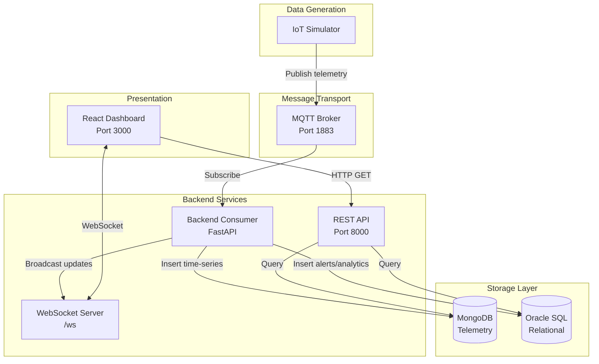
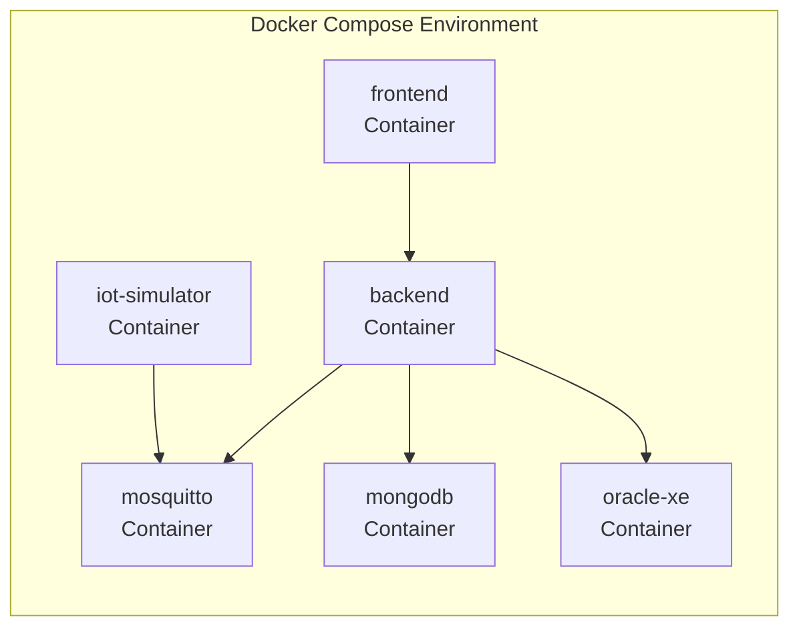

# Design Document: Smart City IoT Sensor Dashboard

## Overview

The Smart City IoT Sensor Dashboard is a distributed real-time monitoring platform that collects, stores, analyzes, and visualizes environmental telemetry data from IoT sensors deployed across urban areas. The system employs a hybrid database architecture combining MongoDB for high-frequency time-series data and Oracle SQL for relational data and analytics.

### System Architecture

The platform consists of five primary layers:

1. **Data Generation Layer**: IoT simulators publishing sensor readings via MQTT
2. **Message Transport Layer**: MQTT broker handling pub/sub messaging
3. **Processing Layer**: FastAPI backend consuming MQTT messages, processing data, and managing business logic
4. **Storage Layer**: Hybrid database (MongoDB for telemetry, Oracle for relational/analytics)
5. **Presentation Layer**: React frontend with real-time WebSocket updates and interactive visualizations

### Key Design Decisions

**Hybrid Database Strategy**: MongoDB handles high-frequency time-series telemetry (insertions every 5 seconds per sensor) with automatic TTL-based cleanup, while Oracle manages structured relational data (location hierarchy, sensor registry, alerts, analytics summaries) requiring complex queries and ACID transactions.

**MQTT for Telemetry**: MQTT provides lightweight, reliable pub/sub messaging suitable for IoT devices with constrained resources and intermittent connectivity.

**WebSocket for Real-Time Updates**: Bidirectional WebSocket connections enable server-push updates to the dashboard without polling overhead.

**Automatic Data Lifecycle**: TTL indexes in MongoDB automatically expire telemetry data after 30 days, eliminating manual cleanup processes and controlling storage costs.

## Architecture

### Component Diagram



### Data Flow

**Telemetry Collection Flow**:
1. IoT Simulator generates sensor readings every 5 seconds
2. Publishes JSON message to MQTT topic `sensors/{sensorId}/telemetry`
3. Backend Consumer receives message via MQTT subscription
4. Parses and validates telemetry data
5. Inserts document into MongoDB `telemetry` collection
6. Checks alert thresholds (CO2 > 1000 ppm, Noise > 85 dB)
7. If threshold exceeded, creates alert record in Oracle
8. Broadcasts telemetry and alerts to WebSocket clients
9. Frontend receives real-time updates and refreshes visualizations

**Analytics Flow**:
1. Backend periodically aggregates telemetry data from MongoDB
2. Calculates moving averages using Oracle window functions
3. Computes Clean Score for each location
4. Stores daily summaries in Oracle `TELEMETRY_SUMMARY` table
5. REST API serves analytics data to frontend
6. Frontend displays leaderboard and trend charts

### Deployment Architecture



All services run in Docker containers orchestrated by Docker Compose with persistent volumes for database storage.

## Components and Interfaces

### IoT Simulator

**Responsibility**: Generate and publish simulated sensor telemetry data

**Implementation**: Python script using `paho-mqtt` library

**Configuration**:
- MQTT broker address (environment variable)
- Sensor ID list
- Publishing interval (5 seconds)
- Value ranges: CO2 (300-2000 ppm), Noise (30-100 dB), Temperature (15-35°C)

**Interface**:
```python
# MQTT Publish
Topic: sensors/{sensorId}/telemetry
Payload: {
    "sensorId": "string",
    "locationId": "string",
    "co2": float,
    "noise": float,
    "temperature": float,
    "timestamp": "ISO8601 string"
}
```

### MQTT Broker

**Responsibility**: Message routing between publishers and subscribers

**Implementation**: Eclipse Mosquitto

**Configuration**:
- Port: 1883 (MQTT)
- Anonymous access enabled for development
- Persistence enabled

### Backend Consumer

**Responsibility**: Core business logic, data processing, and API services

**Implementation**: Python FastAPI application

**Modules**:

1. **MQTT Consumer Module**
   - Subscribes to `sensors/+/telemetry` topic
   - Parses incoming messages
   - Validates data integrity
   - Triggers storage and alert processing

2. **Database Module**
   - MongoDB client for telemetry operations
   - Oracle client for relational operations
   - Connection pooling and retry logic

3. **Alert Engine Module**
   - Evaluates telemetry against thresholds
   - Creates alert records
   - Implements 5-minute deduplication window
   - Broadcasts alerts via WebSocket

4. **Analytics Module**
   - Calculates moving averages
   - Computes Clean Score
   - Generates daily summaries
   - Scheduled background tasks

5. **REST API Module**
   - FastAPI router definitions
   - Request validation using Pydantic models
   - Response serialization
   - Error handling middleware

6. **WebSocket Module**
   - Connection management
   - Client registry
   - Broadcast functionality
   - Heartbeat/keepalive

**REST API Endpoints**:

```
GET /api/locations
Response: List[Location]
Description: Retrieve complete location hierarchy

GET /api/sensors
Response: List[Sensor]
Description: Retrieve all registered sensors with location info

GET /api/telemetry/{sensorId}?start_time=&end_time=
Response: List[Telemetry]
Description: Retrieve telemetry data with optional time range

GET /api/sensors/{sensorId}/analytics
Response: Analytics
Description: Retrieve moving averages and trends

GET /api/alerts?level=&location_id=
Response: List[Alert]
Description: Retrieve alerts with optional filters

GET /api/leaderboard
Response: List[LeaderboardEntry]
Description: Retrieve locations ranked by Clean Score
```

**WebSocket Interface**:

```
Connection: ws://backend:8000/ws

Server -> Client Messages:
{
    "type": "telemetry",
    "data": Telemetry
}

{
    "type": "alert",
    "data": Alert
}

{
    "type": "connection_ack",
    "message": "Connected successfully"
}
```

### MongoDB Store

**Responsibility**: High-frequency time-series telemetry storage

**Collections**:

```javascript
// telemetry collection
{
    "_id": ObjectId,
    "sensorId": String,
    "locationId": String,
    "co2": Number,
    "noise": Number,
    "temperature": Number,
    "timestamp": ISODate
}

// Indexes
{
    "sensorId": 1,
    "timestamp": -1
}

// TTL Index
{
    "timestamp": 1
}, { expireAfterSeconds: 2592000 } // 30 days
```

**Performance Considerations**:
- Compound index on (sensorId, timestamp) for efficient range queries
- TTL index for automatic data expiration
- Write concern: w=1 for performance (acceptable for telemetry data)
- Read preference: primaryPreferred

### Oracle Store

**Responsibility**: Relational data, hierarchy, alerts, and analytics

**Schema**:

```sql
-- LOCATIONS table
CREATE TABLE LOCATIONS (
    LocationID VARCHAR2(50) PRIMARY KEY,
    Name VARCHAR2(100) NOT NULL,
    ParentID VARCHAR2(50),
    Type VARCHAR2(20) CHECK (Type IN ('City', 'District', 'Ward')),
    FOREIGN KEY (ParentID) REFERENCES LOCATIONS(LocationID)
);

CREATE INDEX idx_locations_parent ON LOCATIONS(ParentID);

-- SENSOR_REGISTRY table
CREATE TABLE SENSOR_REGISTRY (
    SensorID VARCHAR2(50) PRIMARY KEY,
    LocationID VARCHAR2(50) NOT NULL,
    SensorType VARCHAR2(20) CHECK (SensorType IN ('CO2', 'Noise', 'Temperature')),
    RegisteredAt TIMESTAMP DEFAULT CURRENT_TIMESTAMP,
    FOREIGN KEY (LocationID) REFERENCES LOCATIONS(LocationID)
);

CREATE INDEX idx_sensors_location ON SENSOR_REGISTRY(LocationID);

-- ALERTS table
CREATE TABLE ALERTS (
    AlertID VARCHAR2(50) PRIMARY KEY,
    SensorID VARCHAR2(50) NOT NULL,
    MetricType VARCHAR2(20) NOT NULL,
    Value NUMBER NOT NULL,
    Level VARCHAR2(10) CHECK (Level IN ('LOW', 'MEDIUM', 'HIGH')),
    CreatedAt TIMESTAMP DEFAULT CURRENT_TIMESTAMP,
    FOREIGN KEY (SensorID) REFERENCES SENSOR_REGISTRY(SensorID)
);

CREATE INDEX idx_alerts_sensor ON ALERTS(SensorID);
CREATE INDEX idx_alerts_created ON ALERTS(CreatedAt);

-- TELEMETRY_SUMMARY table
CREATE TABLE TELEMETRY_SUMMARY (
    SummaryID VARCHAR2(50) PRIMARY KEY,
    LocationID VARCHAR2(50) NOT NULL,
    Date DATE NOT NULL,
    AvgCO2 NUMBER,
    AvgNoise NUMBER,
    AvgTemperature NUMBER,
    CleanScore NUMBER,
    FOREIGN KEY (LocationID) REFERENCES LOCATIONS(LocationID),
    UNIQUE (LocationID, Date)
);

CREATE INDEX idx_summary_location_date ON TELEMETRY_SUMMARY(LocationID, Date);
```

**Recursive Hierarchy View**:

```sql
CREATE OR REPLACE VIEW LOCATION_HIERARCHY AS
WITH RECURSIVE hierarchy AS (
    SELECT LocationID, Name, ParentID, Type, 
           LocationID as Path, 0 as Level
    FROM LOCATIONS
    WHERE ParentID IS NULL
    UNION ALL
    SELECT l.LocationID, l.Name, l.ParentID, l.Type,
           h.Path || ' > ' || l.LocationID as Path,
           h.Level + 1 as Level
    FROM LOCATIONS l
    INNER JOIN hierarchy h ON l.ParentID = h.LocationID
)
SELECT * FROM hierarchy;
```

### Frontend Dashboard

**Responsibility**: Interactive visualization and user interface

**Implementation**: React with TypeScript

**Key Libraries**:
- `react-leaflet`: Map visualization
- `chart.js` + `react-chartjs-2`: Time-series charts
- `axios`: HTTP client for REST API
- Native WebSocket API for real-time updates

**Components**:

1. **MapView Component**
   - Renders Leaflet map with sensor markers
   - Color-codes markers by alert status
   - Displays popup with sensor details on click
   - Updates markers in real-time

2. **ChartView Component**
   - Line charts for CO2, Noise, Temperature
   - Time range selector (1h, 6h, 24h)
   - Real-time data appending
   - Auto-scaling Y-axis

3. **Leaderboard Component**
   - Table displaying locations ranked by Clean Score
   - Highlights top 3 locations
   - Click handler to zoom map
   - Auto-refresh every 60 seconds

4. **AlertsPanel Component**
   - List of recent 20 alerts
   - Color-coded by severity
   - Filter controls (level, location)
   - Real-time alert notifications

5. **WebSocketManager Service**
   - Establishes WebSocket connection on mount
   - Handles reconnection logic
   - Dispatches messages to appropriate components
   - Connection status indicator

**State Management**:
- React Context for global state (sensors, locations, alerts)
- Local component state for UI interactions
- WebSocket messages trigger state updates

## Data Models

### Telemetry

```python
from pydantic import BaseModel, Field
from datetime import datetime

class Telemetry(BaseModel):
    sensorId: str = Field(..., min_length=1)
    locationId: str = Field(..., min_length=1)
    co2: float = Field(..., ge=0, le=5000)
    noise: float = Field(..., ge=0, le=120)
    temperature: float = Field(..., ge=-50, le=60)
    timestamp: datetime
    
    class Config:
        json_schema_extra = {
            "example": {
                "sensorId": "sensor_001",
                "locationId": "ward_001",
                "co2": 450.5,
                "noise": 65.2,
                "temperature": 25.3,
                "timestamp": "2024-01-15T10:30:00Z"
            }
        }
```

### Location

```python
from pydantic import BaseModel
from typing import Optional, Literal

class Location(BaseModel):
    locationId: str
    name: str
    parentId: Optional[str] = None
    type: Literal["City", "District", "Ward"]
    
    class Config:
        json_schema_extra = {
            "example": {
                "locationId": "district_001",
                "name": "District 1",
                "parentId": "city_hcm",
                "type": "District"
            }
        }
```

### Sensor

```python
from pydantic import BaseModel
from datetime import datetime
from typing import Literal

class Sensor(BaseModel):
    sensorId: str
    locationId: str
    sensorType: Literal["CO2", "Noise", "Temperature"]
    registeredAt: datetime
    
    class Config:
        json_schema_extra = {
            "example": {
                "sensorId": "sensor_001",
                "locationId": "ward_001",
                "sensorType": "CO2",
                "registeredAt": "2024-01-01T00:00:00Z"
            }
        }
```

### Alert

```python
from pydantic import BaseModel
from datetime import datetime
from typing import Literal

class Alert(BaseModel):
    alertId: str
    sensorId: str
    metricType: Literal["CO2", "Noise", "Temperature"]
    value: float
    level: Literal["LOW", "MEDIUM", "HIGH"]
    createdAt: datetime
    
    class Config:
        json_schema_extra = {
            "example": {
                "alertId": "alert_001",
                "sensorId": "sensor_001",
                "metricType": "CO2",
                "value": 1250.0,
                "level": "HIGH",
                "createdAt": "2024-01-15T10:30:05Z"
            }
        }
```

### Analytics

```python
from pydantic import BaseModel
from typing import List

class MovingAverage(BaseModel):
    metric: str
    values: List[float]
    average: float
    window_size: int

class Analytics(BaseModel):
    sensorId: str
    co2_moving_avg: MovingAverage
    noise_moving_avg: MovingAverage
    temperature_moving_avg: MovingAverage
```

### LeaderboardEntry

```python
from pydantic import BaseModel

class LeaderboardEntry(BaseModel):
    locationId: str
    locationName: str
    avgCO2: float
    avgNoise: float
    avgTemperature: float
    cleanScore: float
    rank: int
    
    class Config:
        json_schema_extra = {
            "example": {
                "locationId": "ward_001",
                "locationName": "Ward 1",
                "avgCO2": 420.5,
                "avgNoise": 55.2,
                "avgTemperature": 26.3,
                "cleanScore": 85.5,
                "rank": 1
            }
        }
```


## Correctness Properties

*A property is a characteristic or behavior that should hold true across all valid executions of a system-essentially, a formal statement about what the system should do. Properties serve as the bridge between human-readable specifications and machine-verifiable correctness guarantees.*

### Property 1: Location ParentID Referential Integrity

*For any* location creation request, if the ParentID is not NULL, then the ParentID must reference an existing location in the system, otherwise the creation should be rejected.

**Validates: Requirements 1.2**

### Property 2: Hierarchy Path Completeness

*For any* location in the system, querying its hierarchy path should return a complete chain of locations from that location to the root (City level), with each location's ParentID matching the next location in the chain.

**Validates: Requirements 1.3**

### Property 3: Descendant Query Completeness

*For any* location in the system, querying its descendants should return all locations that have this location as an ancestor (directly or transitively through the ParentID chain).

**Validates: Requirements 1.4**

### Property 4: Hierarchy Type Constraints

*For any* location in the system, if the location type is City then its children must be Districts, if the type is District then its children must be Wards, and if the type is Ward then it should have no location children (only sensors).

**Validates: Requirements 1.5**

### Property 5: Sensor Registration Location Validation

*For any* sensor registration request, the system should accept the registration only if the LocationID references an existing location with type "Ward", and reject all other location types.

**Validates: Requirements 2.2**

### Property 6: Sensor Type Validation

*For any* sensor registration request, the system should accept the registration only if the SensorType is one of "CO2", "Noise", or "Temperature", and reject all other sensor types.

**Validates: Requirements 2.3**

### Property 7: Sensor Registration Response Completeness

*For any* successful sensor registration, the REST API response should contain all required fields (SensorID, LocationID, SensorType, RegisteredAt) plus the complete location hierarchy information for the sensor's location.

**Validates: Requirements 2.4**

### Property 8: Sensor ID Uniqueness

*For any* sensor registration request, if a sensor with the same SensorID already exists in the system, the registration should be rejected, ensuring no duplicate SensorIDs exist.

**Validates: Requirements 2.5**

### Property 9: Telemetry Round-Trip Serialization

*For any* valid Telemetry object, serializing it to JSON and then parsing the JSON back should produce an equivalent Telemetry object with all fields (sensorId, locationId, co2, noise, temperature, timestamp) matching the original.

**Validates: Requirements 5.4, 5.1, 5.3, 3.5**

### Property 10: Invalid Telemetry Rejection

*For any* telemetry message with invalid data (missing required fields, malformed JSON, or invalid data types), the Backend Consumer should reject the message gracefully without crashing and log a descriptive error.

**Validates: Requirements 5.2**

### Property 11: Telemetry Value Range Validation

*For any* telemetry data, the system should accept only values where co2 >= 0, noise is between 0 and 120 dB, and temperature is between -50°C and 60°C, rejecting all values outside these ranges.

**Validates: Requirements 5.5**

### Property 12: Telemetry Storage and Retrieval

*For any* valid telemetry data received by the Backend Consumer, after insertion into MongoDB, querying the telemetry collection by sensorId and timestamp should return a document with all the same field values.

**Validates: Requirements 4.1**

### Property 13: Threshold-Based Alert Generation

*For any* telemetry data where CO2 > 1000 ppm or Noise > 85 dB, the Backend Consumer should create an alert record in Oracle with Level "HIGH", the appropriate MetricType, and the threshold-exceeding value.

**Validates: Requirements 6.1, 6.2**

### Property 14: Alert Deduplication

*For any* sensor, if multiple telemetry readings exceed alert thresholds within a 5-minute window, only the first alert should be created and stored, preventing duplicate alerts for the same sensor within that time period.

**Validates: Requirements 6.5**

### Property 15: Moving Average Calculation

*For any* sensor with telemetry data, the calculated moving average for each metric (CO2, Noise, Temperature) should equal the arithmetic mean of the last N readings (where N is min(10, total_readings)), handling both cases where there are 10 or more readings and fewer than 10 readings.

**Validates: Requirements 7.1, 7.3**

### Property 16: Clean Score Calculation

*For any* location with telemetry data, the Clean Score should be calculated as: 100 - (normalized_CO2 * 0.5 + normalized_Noise * 0.5), where normalized_CO2 = (avgCO2 / 2000) * 100 and normalized_Noise = (avgNoise / 100) * 100.

**Validates: Requirements 8.1, 8.2**

### Property 17: Leaderboard Ordering

*For any* set of locations with Clean Scores, the leaderboard endpoint should return locations ordered by Clean Score in descending order, with the highest scoring (cleanest) location first.

**Validates: Requirements 8.4**

### Property 18: REST API Error Response Codes

*For any* REST API request that fails, the system should return the appropriate HTTP status code: 400 for bad requests (invalid parameters), 404 for resources not found, and 500 for server errors, along with a descriptive error message.

**Validates: Requirements 9.5**

### Property 19: WebSocket Connection Acknowledgment

*For any* client that successfully connects to the WebSocket endpoint "/ws", the server should send a connection confirmation message to that client.

**Validates: Requirements 10.2**

### Property 20: WebSocket Client Isolation

*For any* WebSocket client that disconnects, the disconnection should not affect other connected clients - all other clients should remain connected and continue receiving broadcasts.

**Validates: Requirements 10.5**

## Error Handling

### MQTT Connection Failures

**Scenario**: MQTT broker is unavailable or connection is lost

**Handling**:
- Backend Consumer implements exponential backoff retry strategy (1s, 2s, 4s, 8s, max 60s)
- Logs connection attempts and failures with timestamps
- Continues attempting reconnection indefinitely
- On reconnection, resubscribes to all required topics
- Telemetry data published during downtime is lost (acceptable for real-time monitoring)

### Database Connection Failures

**Scenario**: MongoDB or Oracle database is unavailable

**Handling**:
- Connection pool implements automatic retry with exponential backoff
- Failed database operations return 503 Service Unavailable to API clients
- Critical operations (alert creation) are logged for manual review
- Health check endpoint reports database status
- System continues processing other operations if one database is down (graceful degradation)

### Invalid Telemetry Data

**Scenario**: Malformed JSON, missing fields, or out-of-range values

**Handling**:
- Pydantic validation catches schema violations and raises ValidationError
- Backend Consumer logs validation errors with message content (truncated for privacy)
- Invalid messages are discarded without processing
- Metrics counter tracks invalid message rate for monitoring
- Does not crash or affect processing of valid messages

### Alert Threshold Edge Cases

**Scenario**: Telemetry value exactly equals threshold (e.g., CO2 = 1000 ppm)

**Handling**:
- Thresholds use strict inequality (>) not (>=)
- CO2 = 1000 ppm does not trigger alert, CO2 = 1000.1 ppm does
- Documented clearly in API specification
- Consistent behavior across all metric types

### WebSocket Connection Limits

**Scenario**: Too many concurrent WebSocket connections

**Handling**:
- Configure maximum connection limit (default: 1000)
- New connections beyond limit receive 503 error
- Implement connection timeout (5 minutes idle) to free resources
- Monitor active connection count via metrics
- Log connection/disconnection events for capacity planning

### Time Range Query Edge Cases

**Scenario**: Invalid or missing time range parameters in telemetry queries

**Handling**:
- Default to last 24 hours if no time range specified
- Validate start_time < end_time, return 400 if invalid
- Limit maximum query range to 30 days (TTL period)
- Return empty array for queries beyond data retention period
- Document default behavior in API specification

### Hierarchy Circular References

**Scenario**: Attempt to create location with ParentID that would create a cycle

**Handling**:
- Database foreign key constraint prevents direct self-reference
- Application validates that new ParentID is not a descendant of the location being updated
- Returns 400 Bad Request with error message "Circular reference detected"
- Recursive query with cycle detection in validation logic

### Missing Location Hierarchy Data

**Scenario**: Sensor references location that has incomplete hierarchy chain

**Handling**:
- Referential integrity constraints prevent orphaned locations
- API queries use LEFT JOIN to handle missing parent gracefully
- Return partial hierarchy with NULL for missing ancestors
- Log data integrity warnings for investigation
- Health check endpoint validates hierarchy completeness

## Testing Strategy

### Dual Testing Approach

The system requires both unit testing and property-based testing for comprehensive coverage:

**Unit Tests**: Focus on specific examples, edge cases, integration points, and error conditions. Unit tests validate concrete scenarios and ensure components interact correctly.

**Property Tests**: Verify universal properties across all inputs using randomized test data. Property tests catch edge cases that might not be covered by example-based unit tests.

Both approaches are complementary and necessary - unit tests catch specific bugs and validate integration, while property tests verify general correctness across the input space.

### Property-Based Testing Configuration

**Library Selection**:
- Python backend: Use `hypothesis` library for property-based testing
- Minimum 100 iterations per property test (due to randomization)
- Configure hypothesis with `deadline=None` for database operations

**Test Tagging**:
Each property test must include a comment referencing the design document property:

```python
@given(location=location_strategy())
@settings(max_examples=100)
def test_parent_id_referential_integrity(location):
    """
    Feature: smart-city-iot-dashboard, Property 1: Location ParentID Referential Integrity
    
    For any location creation request, if the ParentID is not NULL, then the ParentID 
    must reference an existing location in the system, otherwise the creation should be rejected.
    """
    # Test implementation
```

**Generator Strategies**:

Property tests require custom Hypothesis strategies for domain objects:

```python
from hypothesis import strategies as st

# Location strategy
@st.composite
def location_strategy(draw):
    return {
        "locationId": draw(st.text(min_size=1, max_size=50)),
        "name": draw(st.text(min_size=1, max_size=100)),
        "parentId": draw(st.one_of(st.none(), st.text(min_size=1, max_size=50))),
        "type": draw(st.sampled_from(["City", "District", "Ward"]))
    }

# Telemetry strategy
@st.composite
def telemetry_strategy(draw):
    return Telemetry(
        sensorId=draw(st.text(min_size=1, max_size=50)),
        locationId=draw(st.text(min_size=1, max_size=50)),
        co2=draw(st.floats(min_value=0, max_value=5000)),
        noise=draw(st.floats(min_value=0, max_value=120)),
        temperature=draw(st.floats(min_value=-50, max_value=60)),
        timestamp=draw(st.datetimes())
    )

# Sensor strategy
@st.composite
def sensor_strategy(draw):
    return {
        "sensorId": draw(st.text(min_size=1, max_size=50)),
        "locationId": draw(st.text(min_size=1, max_size=50)),
        "sensorType": draw(st.sampled_from(["CO2", "Noise", "Temperature"]))
    }
```

### Unit Testing Strategy

**Backend Unit Tests** (pytest):

1. **MQTT Consumer Tests**
   - Test message parsing with valid payloads
   - Test rejection of malformed JSON
   - Test handling of missing required fields
   - Mock MQTT client to avoid external dependencies

2. **Database Layer Tests**
   - Test MongoDB insertion and retrieval
   - Test Oracle query execution
   - Test connection error handling
   - Use test databases or mocking

3. **Alert Engine Tests**
   - Test threshold detection for CO2 and Noise
   - Test alert deduplication logic
   - Test 5-minute window calculation
   - Mock database calls

4. **Analytics Tests**
   - Test moving average with exactly 10 readings
   - Test moving average with fewer than 10 readings
   - Test Clean Score calculation with known values
   - Test normalization edge cases (0, max values)

5. **REST API Tests** (FastAPI TestClient)
   - Test each endpoint with valid requests
   - Test 404 responses for non-existent resources
   - Test 400 responses for invalid parameters
   - Test CORS headers presence
   - Mock database layer

6. **WebSocket Tests**
   - Test connection establishment
   - Test broadcast to multiple clients
   - Test client disconnection handling
   - Use WebSocket test client

**Frontend Unit Tests** (Jest + React Testing Library):

1. **Component Tests**
   - Test MapView renders markers correctly
   - Test ChartView displays data
   - Test Leaderboard sorting and display
   - Test AlertsPanel filtering
   - Mock API calls and WebSocket

2. **Integration Tests**
   - Test WebSocket message handling
   - Test API data fetching and state updates
   - Test component interactions
   - Use MSW (Mock Service Worker) for API mocking

### Integration Testing

**End-to-End Flow Tests**:

1. Publish telemetry via MQTT → Verify storage in MongoDB → Verify WebSocket broadcast
2. Publish threshold-exceeding telemetry → Verify alert creation in Oracle → Verify WebSocket alert broadcast
3. Register sensor → Query via REST API → Verify complete response with hierarchy
4. Create location hierarchy → Query descendants → Verify completeness

**Docker Compose Testing**:

1. Start all services with `docker-compose up`
2. Wait for health checks to pass
3. Run integration test suite against running services
4. Verify data persistence across container restarts

### Test Coverage Goals

- Backend code coverage: Minimum 80%
- Frontend code coverage: Minimum 70%
- All 20 correctness properties: 100% coverage with property tests
- All REST API endpoints: 100% coverage with unit tests
- Critical paths (telemetry ingestion, alert generation): 100% coverage

### Continuous Integration

- Run unit tests on every commit
- Run property tests on every pull request
- Run integration tests on merge to main branch
- Generate coverage reports and fail build if below threshold
- Run linting (pylint, eslint) and type checking (mypy, TypeScript)
