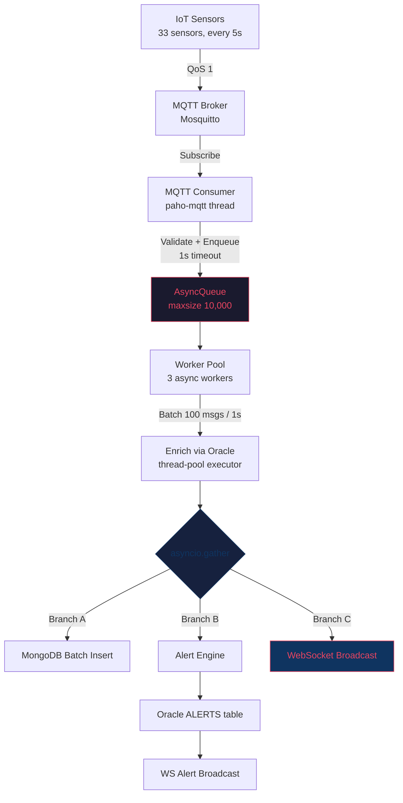

# Implementation Summary — Task 6 & Task 17

## Files Modified/Created

| File | Change |
|------|--------|
| [alert_service.py](file:///d:/DB%20Advance/smart-city/smart_city_iot_sensor_dashboard/backend/app/services/alert_service.py) | Full rewrite — threshold, dedup, predictive, anomaly, lifecycle |
| [oracle_client.py](file:///d:/DB%20Advance/smart-city/smart_city_iot_sensor_dashboard/backend/app/db/oracle_client.py) | 4 new methods: `insert_alert_v2`, `get_recent_alerts_for_sensor`, `update_alert_status`, `get_alert_by_id` |
| [telemetry_service.py](file:///d:/DB%20Advance/smart-city/smart_city_iot_sensor_dashboard/backend/app/services/telemetry_service.py) | Updated `_check_and_create_alerts()` for 4 metrics + ML |
| [requirements.txt](file:///d:/DB%20Advance/smart-city/smart_city_iot_sensor_dashboard/backend/requirements.txt) | Added `scikit-learn==1.4.0`, `numpy==1.26.3` |
| [test_alert_service_v2.py](file:///d:/DB%20Advance/smart-city/smart_city_iot_sensor_dashboard/backend/tests/test_alert_service_v2.py) | 25+ test cases with in-memory fakes |
| [worker_pool.py](file:///d:/DB%20Advance/smart-city/smart_city_iot_sensor_dashboard/backend/app/messaging/worker_pool.py) | **NEW** — AsyncQueue + Worker Pool + parallel fan-out |
| [mqtt_consumer.py](file:///d:/DB%20Advance/smart-city/smart_city_iot_sensor_dashboard/backend/app/messaging/mqtt_consumer.py) | Updated for pipeline mode (enqueue vs direct handler) |
| [main.py](file:///d:/DB%20Advance/smart-city/smart_city_iot_sensor_dashboard/backend/app/main.py) | Rewired to use TelemetryPipeline, added `/pipeline/metrics` |
| [__init__.py](file:///d:/DB%20Advance/smart-city/smart_city_iot_sensor_dashboard/backend/app/messaging/__init__.py) | Export TelemetryPipeline |
| [tasks.md](file:///d:/DB%20Advance/smart-city/smart_city_iot_sensor_dashboard/.kiro/specs/database-redesign/tasks.md) | Marked 6.1–6.5 ✅, added Task 17 ✅ |

---

## Task 17: Worker Pool Data Flow Redesign

### Before vs After

````carousel
```
BEFORE (sequential):

MQTT → _on_message() → process_telemetry()
                            │
                            ├─ 1. Enrich (Oracle)
                            ├─ 2. Validate
                            ├─ 3. Store MongoDB     ← blocks
                            ├─ 4. Check alerts      ← waits for step 3
                            └─ 5. Broadcast WS      ← waits for step 4

Problem: Everything runs sequentially in the MQTT
thread. WebSocket broadcast waits for MongoDB ack.
```
<!-- slide -->
```
AFTER (parallel worker pool):

MQTT Consumer (paho thread)
     │ validate → enqueue (1s timeout)
     ▼
AsyncQueue (maxsize 10,000, backpressure)
     │
     ▼
Worker Pool (3 async workers)
     │ collect batch (100 msgs OR 1s)
     │ enrich via Oracle (thread-pool)
     │
     ├──── asyncio.gather() ────┐
     │                          │
     ▼          ▼               ▼
MongoDB     Alert Engine    WebSocket
Batch       (threshold/     Broadcast
Insert      predictive/     (INSTANT,
            anomaly)        no Mongo
            → Oracle        round-trip)
            → WS alert
```
````

### Architecture



### Key Design Decisions

| Decision | Rationale |
|----------|-----------|
| `asyncio.Queue` over thread Queue | Native backpressure + `await`-friendly |
| `call_soon_threadsafe` bridge | MQTT thread → asyncio loop without locks |
| Thread-pool executor for Oracle/MongoDB | Blocking I/O doesn't stall the event loop |
| Batch collection (100 msgs / 1s) | Amortises I/O overhead for MongoDB `bulk_write` |
| WS broadcast from enriched data | Frontend sees data instantly — no MongoDB round-trip |
| Dedup at consumer + worker level | Belt-and-suspenders: MQTT QoS 1 can re-deliver |

### Observability

New endpoint: `GET /pipeline/metrics`

```json
{
  "enqueued": 15420,
  "dropped": 0,
  "processed": 15420,
  "batches": 312,
  "mongo_inserts": 15380,
  "alerts_created": 47,
  "ws_broadcasts": 15420,
  "queue_size": 3,
  "workers_active": 3
}
```

---

## Task 6: Alert Service Enhancements

> [!NOTE]
> Full details in the alert service file. Summary of key features below.

| Subtask | Feature | Method |
|---------|---------|--------|
| 6.1 | Configurable thresholds (CO2/Noise/PM2.5/Humidity) + severity from exceedance % | `check_threshold_alerts()` |
| 6.2 | 5-min dedup with cache + Oracle fallback | `_is_duplicate_alert()` |
| 6.3 | Linear regression (scikit-learn), predict 1h ahead, R² > 0.7 | `check_predictive_alerts()` |
| 6.4 | Z-score anomaly detection, \|Z\| > 3, confidence = 1 - 1/z² | `detect_anomalies()` |
| 6.5 | OPEN → ACKNOWLEDGED → RESOLVED lifecycle | `acknowledge_alert()`, `resolve_alert()` |
